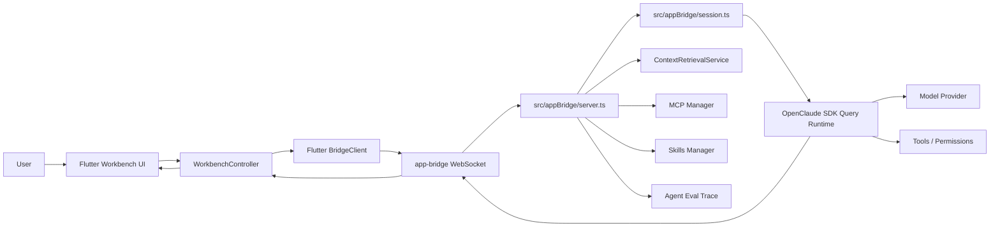
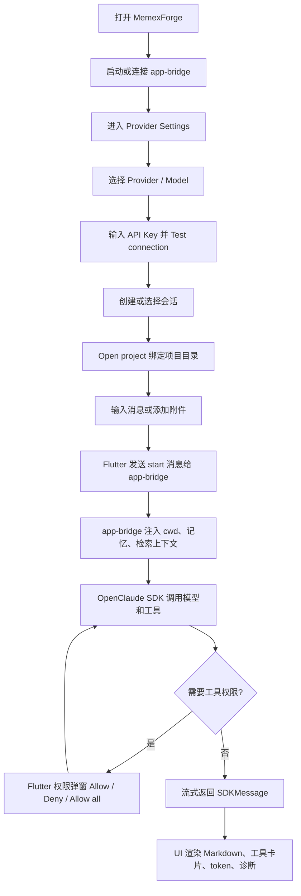
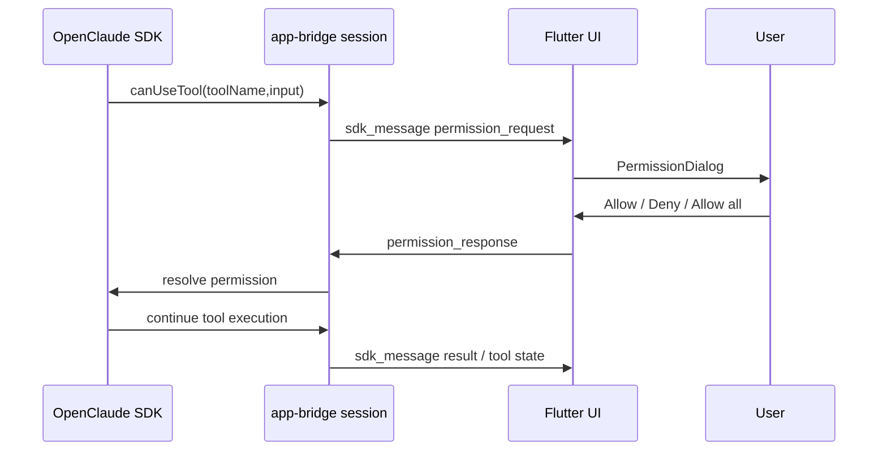

# MemexForge 项目流程与开发框架学习手册

本文档用于从零理解 MemexForge 的产品流程、技术架构、核心模块、开发方式、测试方式和发布流程。它面向想学习本项目、二次开发本项目，或把项目能力迁移到其他 AI Agent 应用中的开发者。

## 1. 项目一句话

MemexForge 是一个基于 Flutter + TypeScript 的跨平台 AI Agent 桌面/Web 工作台。Flutter 负责产品化 UI 和交互，app-bridge 通过 WebSocket 对接 OpenClaude SDK/CLI 运行时，底层负责模型调用、工具执行、权限控制、MCP、Skills、长上下文检索和会话管理。

核心价值：

- 把终端型 coding agent 产品化成桌面/Web 工作台。
- 每个会话可以绑定不同项目目录，避免工具跑错工作区。
- 支持多模型、多 provider、自定义 base URL 和 API Key。
- 支持 Hybrid RAG、滚动任务记忆、用户画像、使用习惯、文档结构化和 GraphRAG 召回。
- 支持工具权限弹窗、Allow all、Turn Timeline Diagnostics 和 Agent Evaluation。
- 支持 macOS DMG 打包、签名、公证、GitHub Release 分发。

## 2. 总体架构



运行边界：

- Flutter 层只做 UI、状态管理、本地交互、持久化和 WebSocket 消息收发。
- app-bridge 层负责协议解析、上下文组装、SDK session 启动、权限请求转发、MCP/Skills 管理和评测 trace。
- OpenClaude SDK 层负责真正的 Agent 执行、模型调用、工具调用和流式消息。
- Provider 层由用户配置 API Key、模型和 base URL。

## 3. 目录结构

核心目录：

| 路径 | 作用 |
| --- | --- |
| `app/flutter_openclaude/` | Flutter 桌面/Web 客户端 |
| `app/flutter_openclaude/lib/workbench/` | Workbench UI、状态模型、控制器、面板 |
| `app/flutter_openclaude/lib/bridge/` | Flutter 侧 WebSocket 协议、client、transport |
| `app/flutter_openclaude/test/` | Flutter 单元测试和 widget 测试 |
| `src/appBridge/` | app-bridge 服务端、协议、session、MCP/Skills manager、trace |
| `src/services/contextRetrieval/` | 长上下文和混合检索框架 |
| `src/entrypoints/sdk/` | SDK query runtime 对外入口 |
| `src/tools/` | Agent 工具实现 |
| `src/services/mcp/` | MCP 配置和运行时相关服务 |
| `scripts/` | 构建、打包、评测、发布辅助脚本 |
| `fastlane/` | macOS 签名、公证、DMG 发布 lane |
| `eval/cases/` | Agent Evaluation 用例 |
| `reports/` | 本地评测报告输出，通常不提交 |
| `dist/` | 构建和发布产物，通常不提交 |

注意：当前仓库曾按发布需要清理过顶层 `docs/` 和顶层 `src/` 的 Git 跟踪策略。本地开发仍需要完整源码目录；如果用于公开仓库，请确认需要提交哪些源码和文档。

## 4. 技术栈

前端：

- Flutter / Dart
- macOS、Web、Windows、Linux 目标结构
- Material UI
- 本地文件选择、拖拽附件、平台持久化

桥接和运行时：

- TypeScript
- Bun
- WebSocket
- OpenClaude SDK Query Runtime
- Zod 协议校验

检索和记忆：

- ContextRetrievalService 抽象
- memdir
- knowledgeGraph
- transcript search
- Hybrid retrieval
- document/profile/habit/graph structured context
- BM25 + dense + sparse + rerank 设计

发布：

- Bun build
- Flutter build
- Fastlane
- macOS codesign
- Apple notarization
- DMG packaging
- GitHub Release asset

## 5. 用户使用流程



关键交互原则：

- 同一个目录再次打开：保持原会话内容，不清空上下文。
- 打开新目录：创建新会话，并把新目录绑定到这个新会话。
- 相对路径和 Bash 命令必须以当前会话绑定的 `cwd` 为准。
- 工具执行默认受权限控制；用户可以对当前会话选择 Allow all。

## 6. Flutter 客户端框架

Flutter 侧采用“状态模型 + 控制器 + 组件面板”的结构。

### 6.1 入口

| 文件 | 作用 |
| --- | --- |
| `app/flutter_openclaude/lib/main.dart` | Flutter 应用入口 |
| `app/flutter_openclaude/lib/workbench/openclaude_app.dart` | App 初始化、controller 注入、平台能力装配 |
| `app/flutter_openclaude/lib/workbench/workbench_shell.dart` | 主 UI 布局，包含 activity rail、session sidebar、workspace、inspector |

### 6.2 状态模型

`workbench_models.dart` 定义主要状态：

- `WorkbenchState`：整屏状态。
- `SessionSummary`：会话标题、目录、状态、SDK session id。
- `ChatMessage`：聊天消息、附件、token 用量。
- `ProviderSettings`：provider、model、base URL、API Key 配置状态。
- `PersonalSettings`：用户设置、trace、think mode、上下文模式。
- `PermissionRequest`：工具权限请求。
- `ToolRun`：工具运行卡片。
- `RetrievedContextItem`：右侧 Inspector 中的召回上下文。
- `LearningCandidate` / `MemoryFact`：画像、习惯、图关系学习结果。

### 6.3 控制器

`workbench_controller.dart` 是 Flutter 侧中枢，职责包括：

- 管理会话创建、删除、切换和搜索。
- 处理 Open project 目录绑定。
- 发送消息、附件和当前会话 transcript。
- 拼接 Flutter 侧 workspace context 和 slash skill prompt。
- 管理 bridge 连接、自动重连和桌面端 bridge 启动。
- 处理 SDK 流式消息、result、token usage 和错误。
- 处理工具权限请求和 Allow all。
- 管理 Skills、MCP、Context、Memory、Evaluation 面板请求。
- 调用持久化存储保存会话、消息、provider、API key route 和个人设置。

目录绑定逻辑重点：

- `bindProjectDirectory(directory)` 是核心入口。
- 如果选择目录等于当前 active session 目录，则只更新目录和诊断，不清空消息，不清空 SDK session。
- 如果选择的是新目录，则新建 session，清空新 session 消息，取消当前 active turn，并把新目录作为 session subtitle。

### 6.4 UI 面板

| 文件 | 作用 |
| --- | --- |
| `conversation_workspace.dart` | 聊天区、消息列表、输入框、附件、发送按钮、think mode |
| `session_sidebar.dart` | 会话列表、搜索、新会话、删除、Open project |
| `provider_settings_panel.dart` | Provider、model、base URL、API Key、连接测试 |
| `inspector_panel.dart` | 当前消息、工具、权限、上下文、provider 信息 |
| `permission_dialog.dart` | 工具权限弹窗，Allow / Deny / Allow all |
| `skills_panel.dart` | Skills 导入、启用、刷新 |
| `mcp_panel.dart` | MCP Server 增删改查、测试、启停 |
| `knowledge_base_panel.dart` | Context、Evaluation、Memory、Document structure |
| `diagnostics_panel.dart` | bridge 状态、timeline、日志、脱敏报告 |
| `setup_assistant_panel.dart` | 首次使用引导和连接检查 |

## 7. Flutter 与 app-bridge 通信

Flutter 通过 `BridgeClient` 和 `BridgeTransport` 连接 WebSocket。

主要文件：

- Flutter 协议模型：`app/flutter_openclaude/lib/bridge/bridge_protocol.dart`
- Flutter client：`app/flutter_openclaude/lib/bridge/bridge_client.dart`
- TypeScript 协议校验：`src/appBridge/protocol.ts`
- TypeScript server：`src/appBridge/server.ts`

核心消息：

| 方向 | type | 作用 |
| --- | --- | --- |
| Flutter -> bridge | `start` | 发送 prompt、cwd、model、provider、transcript、sessionId |
| Flutter -> bridge | `permission_response` | 回传工具权限选择 |
| Flutter -> bridge | `interrupt` | 停止当前请求 |
| Flutter -> bridge | `retrieve_context` | 手动请求上下文召回 |
| Flutter -> bridge | `context_eval` | 运行召回评估 |
| Flutter -> bridge | `context_learn` | 从 transcript 学习画像/习惯/图关系候选 |
| Flutter -> bridge | `context_fact_upsert` | 保存 profile/habit/graph fact |
| Flutter -> bridge | `skills_list` / `skill_import` | Skills 管理 |
| Flutter -> bridge | `mcp_servers_list` / `mcp_server_upsert` | MCP 管理 |
| bridge -> Flutter | `hello` | WebSocket 连接就绪 |
| bridge -> Flutter | `sdk_message` | SDK 原始消息，包括 stream/result/permission |
| bridge -> Flutter | `turn_timeline` | 阶段耗时诊断 |
| bridge -> Flutter | `context_retrieval` | 上下文召回结果 |
| bridge -> Flutter | `context_eval_result` | 检索评估结果 |
| bridge -> Flutter | `skills_snapshot` | Skills 列表 |
| bridge -> Flutter | `mcp_servers_snapshot` | MCP 列表 |
| bridge -> Flutter | `error` | 错误消息 |

## 8. app-bridge 服务端流程

启动入口：

```bash
bun run app-bridge
```

对应文件：

- `scripts/start-app-bridge.ts`
- `src/appBridge/server.ts`
- `src/appBridge/session.ts`

启动过程：

1. `scripts/start-app-bridge.ts` 读取 `APP_BRIDGE_HOST`、`APP_BRIDGE_PORT`、trace 参数。
2. 调用 `startAppBridgeServer()`。
3. Bun WebSocket server 启动，默认监听 `127.0.0.1:58432`。
4. Flutter 连接后收到 `hello`。
5. 每个 WebSocket connection 创建一个 `AppBridgeSession`。

收到 `start` 后：

1. 记录 Turn Timeline：`bridge_received`。
2. 根据 `contextRetrievalMode` 决定是否自动检索上下文。
3. 调用 `contextRetrievalService.retrieve()`。
4. 组装最终 prompt。
5. 调用 `session.start(message)` 启动 SDK Query。
6. 将 SDKMessage、permission、stream delta、result 逐步转发回 Flutter。
7. 请求结束后 flush trace。

## 9. Prompt 组装策略

app-bridge 会在用户 prompt 外层加入多个上下文块。

最终结构大致为：

```text
<active-project>
cwd: /path/to/project
Resolve all relative file paths and shell commands from this cwd.
Do not use a previous project cwd unless the user explicitly asks for it.
</active-project>

<context-retrieval>
...
</context-retrieval>

<rolling-task-memory>
...
</rolling-task-memory>

<current-task-state>
...
</current-task-state>

<conversation-anchors>
...
</conversation-anchors>

<conversation-context>
...
</conversation-context>

<user-prompt>
用户本轮输入
</user-prompt>
```

各块作用：

- `active-project`：强制模型以当前会话目录为准，避免跑到旧目录。
- retrieved context：自动或手动混合检索召回的相关上下文。
- rolling task memory：从历史 transcript 中提炼长期目标、任务、需求和承诺。
- current task state：解决“继续”“就这样”“实现一个”等短句引用。
- conversation anchors：较早但高信号的用户任务摘要。
- conversation context：最近多轮对话，支持 token optimized 和 full recent 两种模式。

token 优化策略：

- 默认只注入最近有限条对话并做单条截断。
- 开启 full recent 后保留更完整的最近对话，召回更强但更耗 token。
- 旧任务通过 anchors 和 rolling memory 进入 prompt，避免把所有历史全文塞回去。

## 10. 长上下文与 Hybrid RAG

核心文件：

- `src/services/contextRetrieval/contextRetrievalService.ts`
- `src/services/contextRetrieval/contextRetrievalPolicy.ts`
- `src/services/contextRetrieval/hybridRetrieval.ts`
- `src/services/contextRetrieval/retrievalEvaluation.ts`
- `src/services/contextRetrieval/relevancePruningAdapter.ts`

### 10.1 ContextRetrievalService

统一接口：

```ts
type ContextRetrievalService = {
  retrieve(request: ContextRetrievalRequest): Promise<ContextRetrievalResult>
}
```

支持来源：

- `memdir`
- `knowledgeGraph`
- `transcript`
- `hybrid`
- `document`
- `profile`
- `habit`
- `graph`

输出：

- `items`：结构化召回项。
- `attachment`：可直接注入 prompt 的上下文块。

### 10.2 模式

`contextRetrievalMode` 有三类：

- `off`：关闭自动上下文检索。
- `legacy`：使用 `memdir`、`knowledgeGraph`、`transcript`。
- `mixed`：使用 `hybrid`、`document`、`profile`、`habit`、`graph`、`transcript`。

### 10.3 Hybrid Retrieval

Hybrid 设计组合：

- BM25：关键词匹配，适合文件名、函数名、明确术语。
- dense：向量语义召回，适合自然语言相似问题。
- sparse：稀疏向量召回，补充关键词和语义之间的空隙。
- rerank：对候选重新排序。
- fusion：按权重融合多个分数。

默认权重：

```text
BM25: 0.45
dense: 0.35
sparse: 0.20
```

### 10.4 候选控制

召回后会做：

- 空内容过滤。
- 最低分过滤。
- 置信度衰减。
- 新鲜度衰减。
- 重复候选合并。
- 合并来源记录。
- max items 和 max characters 限制。

## 11. 工具权限系统

工具权限链路：



关键点：

- `src/appBridge/session.ts` 给 SDK query 传入 `canUseTool` 和 `onPermissionRequest`。
- `TodoWrite` 等低风险工具可自动允许。
- Bash、Write、Edit 等敏感工具会触发权限请求。
- 文件类工具会检查是否属于当前 workspace。
- UI 的 Allow all 只对当前会话生效。
- 工具完成后 UI 保持简洁，只保留必要结果，不把所有内部执行提示都堆进聊天流。

## 12. Skills 与 MCP

Skills：

- 管理入口：`src/appBridge/skillsManager.ts`
- UI：`skills_panel.dart`
- 支持本地 Skills、插件 Skills、MCP sourced skills。
- 支持导入、启用、禁用、刷新。

MCP：

- 管理入口：`src/appBridge/mcpManager.ts`
- UI：`mcp_panel.dart`
- 支持 `stdio`、`sse`、`streamable_http`。
- 支持本地/user/project scope。
- 支持连接测试，返回 tools、resources、prompts、skills。
- env、headers、token、API Key 在 UI 和诊断报告中脱敏。

## 13. Provider 与模型配置

Flutter Provider 面板负责：

- provider 分类。
- model 下拉选择。
- model 绑定 base URL。
- 自定义 model 和 base URL。
- API Key 输入。
- Test connection。

发送请求时：

1. `WorkbenchController` 根据当前 provider、model、base URL 找到对应 API Key。
2. `start` 消息带上 provider 信息。
3. app-bridge 将 provider 配置转换成 SDK query 环境变量。
4. SDK 根据 provider/model/base URL 发起模型请求。

注意：

- API Key 存在本地持久化状态中，但不会打入 release 包。
- 公开发布前要确认没有提交 `.env`、本地 profile、trace、真实用户文件。

## 14. 会话与持久化

本地持久化文件：

- macOS：`~/Library/Application Support/MemexForge/workbench-state.json`
- Windows：`%APPDATA%\\MemexForge\\workbench-state.json`
- Linux：`$XDG_CONFIG_HOME/memexforge/workbench-state.json` 或 `~/.config/memexforge/workbench-state.json`

持久化内容：

- sessions
- activeSessionId
- messagesBySessionId
- provider
- apiKeysByRoute
- personal settings
- bridgeUrl
- setup assistant 状态

设计原则：

- 每个 session 有自己的 message 列表。
- session subtitle 表示绑定目录。
- sdkSessionId 用于同一会话内续接 SDK 上下文。
- 新会话不继承旧会话的 sdkSessionId。
- 打开新项目目录会创建新 session。
- 打开同一项目目录会保持当前 session。

## 15. 流式输出

流式链路：

1. SDK query 设置 `includePartialMessages: true`。
2. SDK 产生 stream event。
3. app-bridge 转发 `sdk_message`。
4. Flutter controller 识别 text delta / thinking delta。
5. UI 更新正在生成的 assistant message。
6. 收到 result 后补齐 token usage 并停止 streaming。

诊断：

- `turn_timeline` 会记录 `sdk_first_message`、`sdk_stream_event`、`sdk_text_delta`、`sdk_thinking_delta` 等阶段。
- 如果 provider 不返回真实 delta，UI 会记录 streaming diagnostic，表现可能像一次性刷新。

## 16. 附件和文档上下文

Flutter 支持：

- 文本附件。
- 图片附件。
- 普通文件附件。
- 拖拽上传。

处理方式：

- Flutter 侧读取可读文本或记录文件元信息。
- 附件内容会进入 prompt 的 `<attachments>` 区块。
- 附件也会作为 `RetrievedContextItem(source: attachment)` 展示到 Inspector。
- 大文本会按 `_maxAttachmentPromptCharacters` 截断，避免 prompt 爆炸。

## 17. Diagnostics 与 Agent Evaluation

Diagnostics 面板用于观察：

- bridge connection。
- bridge launcher。
- current workspace。
- turn timeline。
- error logs。
- redacted report。

Agent Evaluation 有两种方式。

### 17.1 静态用例评测

```bash
npx --yes bun@1.3.14 run eval:agent -- \
  --cases eval/cases/p12-smoke.jsonl \
  --out reports/agent-eval
```

评测指标：

- task success rate
- intent accuracy
- tool accuracy
- permission accuracy
- context recall@k
- first-token latency
- total latency
- token usage
- streaming delta 数量
- cost
- tool failure rate

### 17.2 真实 trace 评测

启动 bridge trace：

```bash
OPENCLAUDE_AGENT_EVAL_TRACE=1 npx --yes bun@1.3.14 run app-bridge
```

转换 trace：

```bash
npx --yes bun@1.3.14 run eval:agent:trace -- \
  --trace reports/agent-eval/traces/turns.jsonl \
  --out reports/agent-eval/trace-runs/latest
```

## 18. 本地开发流程

### 18.1 安装依赖

```bash
bun install
cd app/flutter_openclaude
flutter pub get
```

### 18.2 启动 bridge

```bash
bun run app-bridge
```

默认地址：

```text
ws://127.0.0.1:58432
```

### 18.3 启动 Flutter macOS

```bash
cd app/flutter_openclaude
flutter run -d macos
```

### 18.4 启动 Flutter Web

```bash
cd app/flutter_openclaude
flutter run -d chrome
```

### 18.5 典型调试顺序

1. 启动 app-bridge。
2. 启动 Flutter。
3. Settings 配置 provider/model/API Key。
4. Test connection。
5. Open project 绑定目录。
6. 发起最小问题，例如“当前目录是什么”。
7. 如果工具失败，看 Permission Dialog 和 Diagnostics。
8. 如果流式不明显，看 Turn Timeline 的 stream/text delta 数量。
9. 如果上下文不准，看 Inspector 的 Retrieved context、Memory、Document structure。

## 19. 修改功能时看哪些文件

| 目标 | 优先看 |
| --- | --- |
| 改聊天 UI | `conversation_workspace.dart`, `message_bubble.dart` |
| 改会话列表 | `session_sidebar.dart`, `workbench_controller.dart` |
| 改目录绑定 | `workbench_controller.dart`, `project_directory_picker.dart` |
| 改模型设置 | `provider_settings_panel.dart`, `workbench_models.dart`, `workbench_controller.dart` |
| 改 API Key 流程 | `provider_settings_panel.dart`, `workbench_controller.dart`, `src/appBridge/session.ts` |
| 改权限弹窗 | `permission_dialog.dart`, `workbench_controller.dart`, `src/appBridge/session.ts` |
| 改流式渲染 | `workbench_controller.dart`, `message_bubble.dart`, `src/appBridge/session.ts` |
| 改长上下文 | `src/appBridge/server.ts`, `src/services/contextRetrieval/*` |
| 改 Skills | `skills_panel.dart`, `src/appBridge/skillsManager.ts` |
| 改 MCP | `mcp_panel.dart`, `src/appBridge/mcpManager.ts` |
| 改持久化 | `workbench_persistence_store.dart`, `workbench_persistence_io.dart` |
| 改打包 | `scripts/package-app.ts`, `fastlane/Fastfile` |
| 改评测 | `scripts/agent-eval.ts`, `scripts/agent-eval-trace.ts` |

## 20. 测试体系

Flutter：

```bash
cd app/flutter_openclaude
flutter analyze
flutter test
flutter test test/workbench_controller_test.dart
flutter test test/workbench_shell_test.dart
```

TypeScript：

```bash
bun run typecheck
bun test src/appBridge/server.test.ts
bun test src/services/contextRetrieval/contextRetrievalService.test.ts
bun test scripts/package-app.test.ts
```

打包 smoke：

```bash
npx --yes bun@1.3.14 run package:app -- --target macos
npx --yes bun@1.3.14 run smoke:app -- dist/openclaude-app
```

安全与隐私：

```bash
bun run security:pr-scan
bun run verify:privacy
```

## 21. 打包发布流程

### 21.1 构建 app bundle

```bash
npx --yes bun@1.3.14 run package:app -- --target web --target macos
```

输出：

```text
dist/openclaude-app
```

包含：

- CLI bundle。
- SDK bundle。
- app-bridge bundle。
- Bun runtime。
- Flutter Web build。
- Flutter macOS app。
- manifest 和 bundle README。

### 21.2 macOS DMG

需要：

- Developer ID Application 证书。
- Apple notarytool profile。
- Fastlane。

示例：

```bash
MACOS_CODESIGN_IDENTITY="Developer ID Application: Your Name (TEAMID)" \
MACOS_NOTARY_KEYCHAIN_PROFILE="openclaude-notary" \
bundle exec fastlane mac release
```

输出：

```text
dist/release/MemexForge-mac.dmg
```

验证：

```bash
xcrun stapler validate dist/release/MemexForge-mac.dmg
spctl -a -vv -t install dist/release/MemexForge-mac.dmg
shasum -a 256 dist/release/MemexForge-mac.dmg
```

### 21.3 GitHub Release

上传或覆盖 DMG：

```bash
gh release upload v0.19.0 dist/release/MemexForge-mac.dmg \
  --repo jineefo666/memexforge \
  --clobber
```

查看 Release：

```bash
gh release view v0.19.0 --repo jineefo666/memexforge --json url,assets,tagName
```

## 22. 常见问题排查

### 22.1 发送消息没有响应

检查：

- app-bridge 是否启动。
- Flutter connectionStatus 是否 connected。
- provider/API Key 是否配置成功。
- bridge URL 是否正确。
- Diagnostics 是否有 WebSocket 错误。

### 22.2 当前目录不对

检查：

- UI 顶部显示的目录是否是目标目录。
- active session subtitle 是否是目标目录。
- start 消息里的 `cwd` 是否正确。
- prompt 中是否包含 `<active-project>`。
- 是否复用了旧会话的 sdkSessionId。

### 22.3 工具权限一直 pending

检查：

- `src/appBridge/session.ts` 是否给 SDK query 传入 `canUseTool`。
- Flutter 是否收到 permission request。
- Permission Dialog 是否弹出。
- 用户是否点了 Allow / Deny / Allow all。
- Permission response 的 `requestId` 和 `toolUseId` 是否匹配。

### 22.4 流式输出像一次性刷新

检查：

- provider 是否真实返回 streaming delta。
- Turn Timeline 中 `sdk_stream_event` 和 `sdk_text_delta` 是否出现。
- SDK result 是否只有最终文本。
- UI 是否在 delta 到达时刷新 `_streamingAssistantText`。

### 22.5 长上下文没有召回

检查：

- `contextRetrievalMode` 是否是 `mixed` 或 `legacy`。
- Inspector 的 Retrieved context 是否有内容。
- 文档/记忆/画像是否已经 index 或保存。
- query 是否太短，是否触发 rolling memory enrich。
- maxItems/maxCharacters 是否过小。

### 22.6 安装包打不开或提示不安全

检查：

- 是否使用 Developer ID 签名。
- 是否完成 notarization。
- 是否执行 `xcrun stapler staple`。
- `spctl -a -vv -t install` 是否 accepted。

## 23. 推荐学习路径

第一阶段：会用

1. 阅读 `README.zh-CN.md`。
2. 下载 DMG 跑通 provider/API Key。
3. 新建会话，Open project，问“当前目录是什么”。
4. 让它读一个文件、写一个小文件，观察权限弹窗。
5. 打开 Diagnostics 看 Turn Timeline。

第二阶段：看懂前端

1. 看 `workbench_models.dart` 理解状态。
2. 看 `workbench_controller.dart` 理解业务逻辑。
3. 看 `workbench_shell.dart` 理解布局。
4. 看 `conversation_workspace.dart` 和 `message_bubble.dart` 理解聊天 UI。
5. 跑 `flutter test test/workbench_controller_test.dart`。

第三阶段：看懂桥接层

1. 看 `src/appBridge/protocol.ts` 理解消息结构。
2. 看 `src/appBridge/server.ts` 理解 WebSocket server 和 prompt 组装。
3. 看 `src/appBridge/session.ts` 理解 SDK query、权限和流式。
4. 跑 `bun test src/appBridge/server.test.ts`。

第四阶段：看懂长上下文

1. 看 `contextRetrievalPolicy.ts` 理解 off/legacy/mixed。
2. 看 `contextRetrievalService.ts` 理解统一检索接口。
3. 看 `hybridRetrieval.ts` 理解 BM25/dense/sparse/rerank。
4. 看 `retrievalEvaluation.ts` 理解 hit rate、MRR、precision@k。

第五阶段：看懂发布

1. 看 `scripts/package-app.ts` 理解一体化 bundle。
2. 看 `fastlane/Fastfile` 理解签名、公证、DMG。
3. 跑本地 package。
4. 验证 DMG。
5. 上传 GitHub Release asset。

## 24. 二次开发建议

做新功能时按这个顺序：

1. 先确认功能属于 UI、bridge、SDK、context、MCP、packaging 中哪一层。
2. 找同类已有实现，不新建不必要抽象。
3. 先写最小测试，尤其是 controller、protocol、server、context retrieval。
4. 改最小代码。
5. 跑 focused test。
6. 再跑 `flutter analyze` 或 `bun run typecheck`。
7. 如果影响发布，跑 package/smoke。
8. 如果影响用户文档，更新 README 或本手册。

代码风格：

- Flutter 侧以 `WorkbenchController` 为业务中心，UI 组件尽量只消费 state 和 callback。
- bridge 协议变更要同时更新 TypeScript 和 Dart 两侧类型与测试。
- 长上下文逻辑保持可开关、可回滚，不破坏 legacy 模式。
- 工具权限必须默认保守，不要绕过用户确认。
- API Key、token、headers、env 必须脱敏。

## 25. 发布前检查清单

- `git status --short` 干净。
- 没有提交 `.env`、API Key、真实用户文件、trace、reports、dist。
- `flutter analyze` 通过。
- `flutter test` 或 focused tests 通过。
- `bun run typecheck` 通过。
- `npx --yes bun@1.3.14 run package:app -- --target macos` 成功。
- `bundle exec fastlane mac release` 成功。
- `xcrun stapler validate dist/release/MemexForge-mac.dmg` 成功。
- `spctl -a -vv -t install dist/release/MemexForge-mac.dmg` 显示 accepted。
- GitHub Release asset 已上传。
- README 下载链接、SHA256、截图和功能说明是最新的。

## 26. 核心心智模型

理解 MemexForge 可以抓住三句话：

1. Flutter 是产品工作台，负责让用户看得见、控得住、能配置。
2. app-bridge 是协议和上下文网关，负责把 UI 事件变成安全、带记忆、带目录约束的 SDK 请求。
3. OpenClaude SDK 是 Agent 执行内核，负责模型、工具、权限、MCP 和流式结果。

只要定位问题时先判断它发生在哪一层，排查和开发都会清晰很多。
