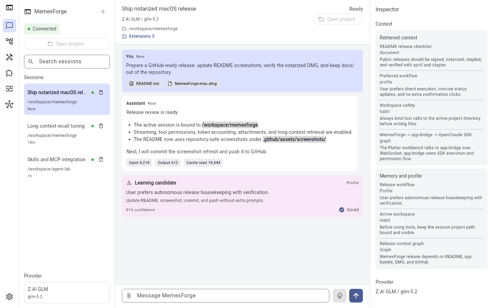
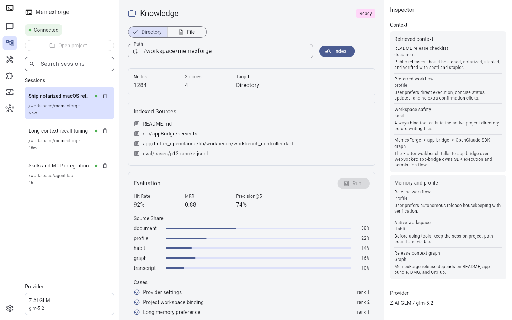
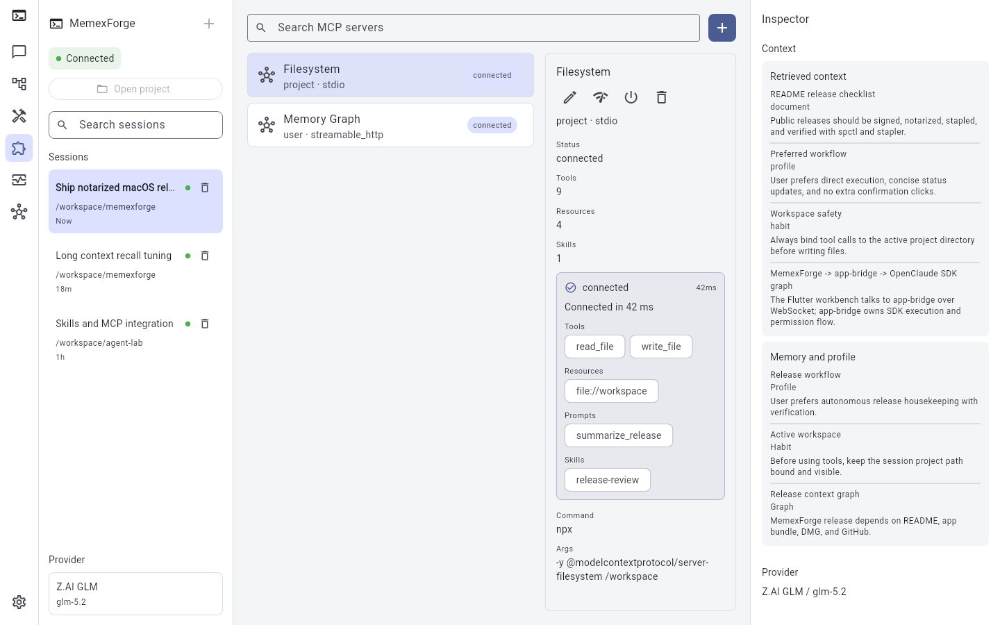
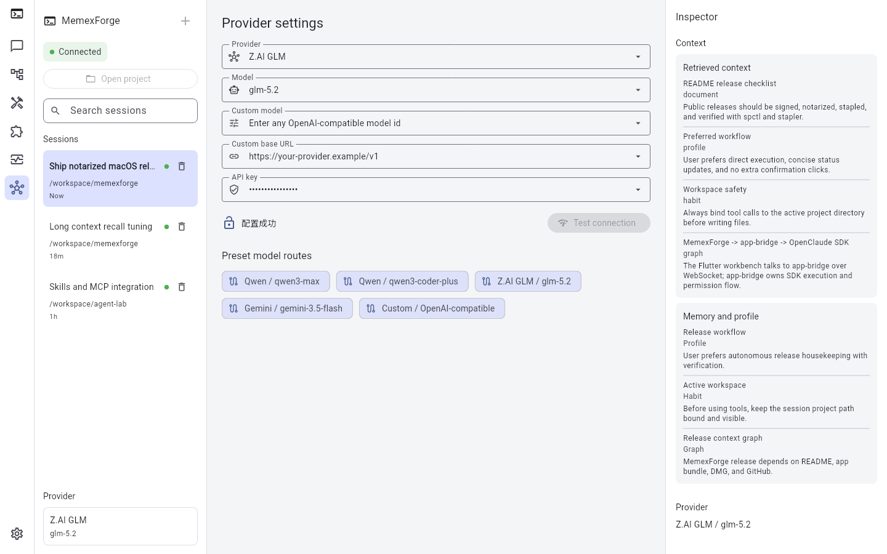
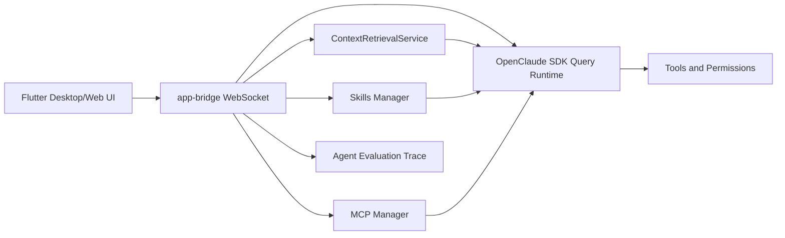

# MemexForge

MemexForge is a cross-platform agent workbench for developers who need an AI assistant that can remember long-running work, operate inside local projects, call tools safely, and stay inspectable.

It wraps the existing OpenClaude CLI and SDK runtime in a Flutter desktop/Web interface. The UI handles chat, sessions, model settings, permissions, skills, MCP servers, context retrieval, diagnostics, and release packaging while the underlying agent execution remains in the OpenClaude TypeScript runtime.

> MemexForge is designed as a local-first workbench. You bring your own provider keys, choose your model, bind each chat session to a project directory, and decide which tool calls are allowed.

[Quick Start](#quick-start) | [Features](#features) | [Screenshots](#screenshots) | [Packaging](#packaging) | [Evaluation](#agent-evaluation) | [Release Checklist](#github-release-checklist) | [License](#license-attribution-and-originality)

## Download

- [Download MemexForge for macOS](https://github.com/jineefo666/memexforge/releases/download/v0.19.0/MemexForge-mac.dmg)
- Release page: [MemexForge v0.19.0](https://github.com/jineefo666/memexforge/releases/tag/v0.19.0)
- SHA256: `227f942f0abb3d4a8c8f7d1fd32d5eaf384516fb9f06dc1679773b5fa0fbda56`

## Highlights

- **Desktop/Web agent UI:** a polished Flutter workbench instead of a terminal-only flow.
- **Session-bound projects:** every chat can be tied to its own working directory, so tools run in the right place.
- **Long-context memory:** recent turns, rolling task memory, hybrid retrieval, profile facts, habits, document structure, and GraphRAG-style recall can all enter the prompt context.
- **Inspectable tools:** permission requests, active tool cards, diagnostics, and turn timelines make agent behavior easier to trust.
- **Skills and MCP:** import skills, configure MCP servers, preview exposed capabilities, and keep sensitive values redacted.
- **Bring your own model:** OpenAI-compatible providers, Qwen/DashScope, Z.AI GLM, Google Gemini, DeepSeek, Ollama, Anthropic-family routes, and custom model/base URL entries.
- **One bundle for release:** packages the Flutter app, app-bridge, CLI, SDK bundle, and Bun runtime together.

## Why MemexForge

Most coding agents are either terminal-first or chat-first. MemexForge is workspace-first:

- It keeps the project directory visible and bound to the active session.
- It streams responses while showing tool calls, permission requests, and diagnostics.
- It combines short-term chat history with long-context retrieval, memory facts, habits, document structure, and graph relationships.
- It lets users manage Skills and MCP servers from the UI instead of editing config files by hand.
- It packages the app, bridge, CLI, SDK bundle, and Bun runtime into a single desktop release directory.

## Features

### Agent Chat

- Multi-session chat sidebar with search and deletion.
- First user message becomes the session title.
- Per-session project directory binding through **Open project**.
- Streaming output with the thinking/loading state attached to the active user message.
- Think mode toggle beside the composer for switching reasoning mode per user preference.
- Markdown rendering for assistant responses.
- Token usage display after responses, including input, output, and cache-read tokens when provided.
- File and image attachments with drag-and-drop support.

### Provider And Model Settings

- Provider as model category.
- Model dropdown with model-bound base URL defaults.
- Latest preset groups for Qwen/DashScope, Z.AI GLM, and Google Gemini.
- Custom OpenAI-compatible model and base URL fields when a provider is not preconfigured.
- API key configuration and connection testing.
- Provider settings are persisted locally, while release packages do not include a user's API key.

Current desktop presets include:

| Provider | Models | Base URL |
| --- | --- | --- |
| Qwen / DashScope | `qwen3-max`, `qwen3-max-preview`, `qwen3-coder-plus`, `qwen3-coder-flash`, `qwen3.5-plus`, `qwen3.5-flash`, `qwen-plus-latest` | `https://dashscope-intl.aliyuncs.com/compatible-mode/v1` |
| Z.AI GLM | `glm-5.2` | `https://api.z.ai/api/coding/paas/v4` |
| Google Gemini | `gemini-3.5-flash`, `gemini-3.1-pro-preview`, `gemini-3.1-flash-lite`, `gemini-3-flash-preview` | `https://generativelanguage.googleapis.com/v1beta/openai/` |
| OpenAI Compatible / Custom | `gpt-5.5`, `gpt-5.5-pro`, DeepSeek presets, or user-entered model IDs | model-specific or user-entered |

### Tool Permissions

- Permission modal for sensitive tool calls.
- Allow, deny, and **allow all for this session** controls.
- One active tool card at a time, with completed tool status cleaned up from the chat flow.
- Inspector panel for tool details and permission request review.

### Long Context

- `ContextRetrievalService` abstraction for document, memory, habit, transcript, graph, and hybrid retrieval sources.
- Rolling Task Memory that distills durable goals, requirements, decisions, and assistant commitments from the full session transcript before each turn.
- BM25, dense, sparse, rerank, and source-fusion architecture.
- Session prompt context injection before each turn.
- Document structure parsing for section-level recall.
- User profile and usage-habit learning candidates.
- GraphRAG-style entity and relationship recall.
- Retrieval evaluation metrics such as hit rate, MRR, precision@k, and source mix.

### Skills And MCP

- Skills inventory with local, plugin, and MCP-sourced skills.
- Import, enable, disable, and refresh actions for skills.
- MCP server CRUD with `stdio`, `sse`, and `streamable_http` transports.
- MCP connection testing with tools, resources, prompts, and skills preview.
- Extensions Marketplace for curated skill and MCP templates.
- Sensitive values in env, headers, tokens, and API keys are redacted in the UI.

### Diagnostics And Release Readiness

- Setup assistant for bridge and API-key readiness.
- Diagnostics panel with connection state, launcher state, workspace, event log, and copyable redacted report.
- Start bridge and reconnect bridge actions for desktop builds.
- P12 agent evaluation reports for quality, latency, token usage, tool failures, and trace-derived metrics.
- Fastlane lane for signed and notarized macOS DMG releases.

## Screenshots

### Chat Workbench



### Long Context And Memory



### MCP Extensions



### Provider Settings



## Architecture



MemexForge keeps the runtime boundary simple:

- Flutter owns product UI and local interaction state.
- app-bridge translates UI events into OpenClaude SDK calls over WebSocket.
- OpenClaude SDK remains the source of truth for agent execution, model routing, tools, MCP, and permissions.
- Context retrieval is injected before each turn without replacing the existing SDK flow.

## Quick Start

### Prerequisites

- Node.js `>=22.0.0`
- Flutter for desktop or Web development
- Bun for source builds and app-bridge packaging, or `npx --yes bun@1.3.14` as a local fallback
- A provider API key, such as OpenAI-compatible, DeepSeek, Gemini, Ollama, Codex, or another supported backend

### Install Dependencies

```bash
bun install
```

### Run The App Bridge

```bash
bun run app-bridge
```

The default endpoint is:

```text
ws://127.0.0.1:58432
```

### Run Flutter Desktop

```bash
cd app/flutter_openclaude
flutter run -d macos
```

### Run Flutter Web

```bash
cd app/flutter_openclaude
flutter run -d chrome
```

### First Use

1. Open **Settings**.
2. Choose a provider category and model, or enter a custom model/base URL.
3. Enter your API key.
4. Click **Test connection**.
5. Open or create a chat session.
6. Click **Open project** and select the project directory for that session.
7. Send a message.
8. Review permission requests before allowing tools.

## Packaging

Build a local release directory:

```bash
npx --yes bun@1.3.14 run package:app -- --target web --target macos
```

The release directory is:

```text
dist/openclaude-app
```

It contains:

- OpenClaude CLI bundle
- OpenClaude SDK bundle
- app-bridge bundle and launcher
- bundled Bun runtime
- Flutter Web build
- Flutter macOS app build
- release manifest and bundle README

### Signed macOS DMG

MemexForge includes a Fastlane lane for Developer ID signing, DMG creation, and Apple notarization:

```bash
xcrun notarytool store-credentials "openclaude-notary" \
  --apple-id "you@example.com" \
  --team-id "TEAMID" \
  --password "app-specific-password"
```

Then run:

```bash
MACOS_CODESIGN_IDENTITY="Developer ID Application: Your Name (TEAMID)" \
MACOS_NOTARY_KEYCHAIN_PROFILE="openclaude-notary" \
npm run release:macos
```

The DMG is written to:

```text
dist/release/MemexForge-mac.dmg
```

For local signing diagnostics without notarization:

```bash
MACOS_CODESIGN_IDENTITY="Developer ID Application: Your Name (TEAMID)" \
MACOS_SKIP_NOTARIZE=1 \
npm run release:macos
```

Skipping notarization creates a signed DMG that is useful for internal testing, but macOS Gatekeeper can still reject or warn with `Unnotarized Developer ID`. Public releases should be notarized and stapled:

```bash
spctl -a -vv -t install dist/release/MemexForge-mac.dmg
xcrun stapler validate dist/release/MemexForge-mac.dmg
```

## Agent Evaluation

Run the deterministic P12 smoke benchmark:

```bash
npx --yes bun@1.3.14 run eval:agent -- --cases eval/cases/p12-smoke.jsonl --out reports/agent-eval
```

Enable real app-bridge trace collection:

```bash
OPENCLAUDE_AGENT_EVAL_TRACE=1 npx --yes bun@1.3.14 run app-bridge
```

Convert a trace into a report:

```bash
npx --yes bun@1.3.14 run eval:agent:trace -- \
  --trace reports/agent-eval/traces/turns.jsonl \
  --out reports/agent-eval/trace-runs/latest
```

Reports include:

- task success rate
- intent accuracy
- tool accuracy
- permission accuracy
- context recall@k
- first-token latency
- total latency
- token usage
- tool failure rate
- estimated cost

## Verification

Useful checks during development:

```bash
npx --yes bun@1.3.14 run typecheck
npx --yes bun@1.3.14 test scripts/package-app.test.ts scripts/smoke-app-bundle.test.ts scripts/fastlane-release.test.ts
cd app/flutter_openclaude && flutter analyze
cd app/flutter_openclaude && flutter test
npx --yes bun@1.3.14 run smoke:app -- dist/openclaude-app
```

## Security And Privacy

- API keys are user-provided and are not bundled into release packages.
- UI and bridge diagnostics redact API keys, bearer tokens, env secrets, and sensitive headers.
- Tool execution requires explicit permission unless the user chooses **allow all for this session**.
- Attachments can reference files outside the project workspace, but tool execution remains permission-gated.
- Local desktop state is stored under the MemexForge application support directory.

## GitHub Release Checklist

Before publishing a public GitHub release:

- Build and smoke-test the bundle with `npx --yes bun@1.3.14 run package:app` and `npx --yes bun@1.3.14 run smoke:app`.
- Produce a Developer ID signed DMG through `npm run release:macos`.
- Notarize and staple the DMG before public distribution.
- Verify `spctl -a -vv -t install dist/release/MemexForge-mac.dmg` accepts the package.
- Confirm no personal API keys, local workspace paths, private traces, generated reports, or real customer/user files are committed.
- Keep screenshots limited to synthetic/demo content.
- Keep the product brand as **MemexForge** and avoid implying affiliation with Anthropic, OpenAI, Google, Alibaba Cloud, Z.AI, DeepSeek, or other model providers.
- Preserve `LICENSE` and this README's attribution notice in source and release artifacts.
- Run a dependency/license review before distributing modified third-party bundles at scale.

## Roadmap

- Secure API-key storage using macOS Keychain and equivalent secure stores on other platforms.
- Richer retrieval evaluation dashboards in Flutter.
- More MCP marketplace templates.
- More precise GraphRAG relationship recall.
- Signed and notarized release automation for every tagged build.

## License, Attribution, And Originality

This repository contains code derived from Anthropic's Claude Code CLI.

OpenClaude contributor modifications and additions are offered under the MIT License where legally permissible. The underlying derived Claude Code material remains subject to Anthropic's copyright and terms. See [LICENSE](LICENSE) for the full legal notice.

MemexForge and OpenClaude are independent community projects. They are not affiliated with, endorsed by, or sponsored by Anthropic. "Claude" and "Claude Code" are trademarks of Anthropic PBC.

MemexForge's product layer, Flutter workbench, app-bridge integration, long-context retrieval architecture, Skills/MCP management UI, diagnostics, evaluation workflow, packaging flow, app icon, and bundled screenshots are project-original additions in this repository unless otherwise noted.

Model provider names such as OpenAI, Gemini, Qwen, GLM, DeepSeek, Ollama, Anthropic, and Claude are used only to describe interoperability. They remain trademarks or service marks of their respective owners.

This README does not claim global novelty, patent priority, or exclusive first use. For public commercialization or a formal "original product" claim, complete an independent legal review, trademark search, and provenance audit.

## Naming Note

The MemexForge name is inspired by the idea of a developer workbench that can preserve, retrieve, and forge useful context across long-running work. It intentionally avoids using "Claude" in the product name while keeping compatibility with the OpenClaude runtime.
