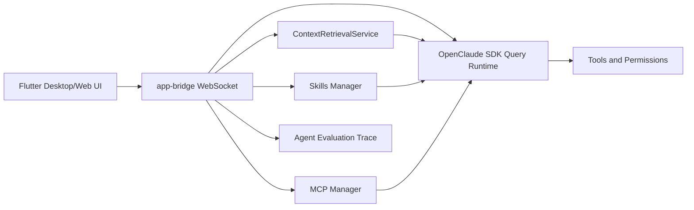

# MemexForge

[English](README.md) | [简体中文](README.zh-CN.md)

MemexForge 是一个面向开发者的跨平台 AI Agent 工作台。它让 AI 助手可以记住长期任务、绑定本地项目目录、安全调用工具，并且把上下文、权限、模型、扩展和诊断过程都展示出来。

项目基于 Flutter 构建桌面端和 Web 端界面，通过 app-bridge 对接 OpenClaude CLI / SDK 运行时。Flutter 负责产品 UI、会话交互、模型设置、权限弹窗、Skills、MCP、上下文检索和诊断面板，底层 Agent 执行仍由 OpenClaude TypeScript 运行时负责。

> MemexForge 是一个 local-first 的工作台。你提供自己的模型 API Key，选择模型，把每个会话绑定到对应项目目录，并决定哪些工具调用可以执行。

[下载](#下载) | [项目学习手册](PROJECT_FLOW_AND_DEV_GUIDE.zh-CN.md) | [核心亮点](#核心亮点) | [功能介绍](#功能介绍) | [截图](#截图) | [快速开始](#快速开始) | [打包发布](#打包发布) | [Agent-评测](#agent-评测) | [许可与原创性说明](#许可与原创性说明)

## 下载

- [下载 macOS 版 MemexForge](https://github.com/jineefo666/memexforge/releases/download/v0.19.0/MemexForge-mac.dmg)
- Release 页面：[MemexForge v0.19.0](https://github.com/jineefo666/memexforge/releases/tag/v0.19.0)
- SHA256：`c5a06a867c251b3d0ebe2f7919b45e5e72caa3f0dd19fb2613c88800e0dc66b7`

## 核心亮点

- **桌面端 / Web 端 Agent UI：** 用 Flutter 提供比终端更产品化的 Agent 工作台体验。
- **会话绑定项目目录：** 每个会话都可以独立绑定工作目录，工具调用会在正确项目中执行。
- **长上下文记忆：** 支持最近对话、滚动任务记忆、Hybrid RAG、用户画像、使用习惯、文档结构化数据和 GraphRAG 关系召回。
- **可检查的工具调用：** 权限请求、工具卡片、Inspector 和 Turn Timeline 让 Agent 行为更透明。
- **Skills 和 MCP 扩展：** 支持导入 Skills、配置 MCP Server、预览工具/资源/Prompt，并对敏感信息做脱敏。
- **多模型可选：** 支持 OpenAI-compatible、Qwen/DashScope、Z.AI GLM、Google Gemini、DeepSeek、Ollama、Anthropic-family 路由和自定义模型/Base URL。
- **一体化打包：** 将 Flutter 应用、app-bridge、CLI、SDK bundle 和 Bun runtime 打成可分发桌面包。

## 为什么做 MemexForge

很多 coding agent 要么偏终端，要么偏普通聊天。MemexForge 更偏向“项目工作台”：

- 当前项目目录始终可见，并且绑定到当前会话。
- 回复可以流式输出，同时展示工具调用、权限请求和诊断信息。
- 短期多轮对话会和长期记忆、文档结构、用户画像、使用习惯、GraphRAG 关系召回一起进入上下文。
- Skills 和 MCP 可以直接在界面中管理，不必完全依赖手写配置文件。
- 支持桌面应用、桥接服务、CLI、SDK 和运行时的一体化发布。

## 功能介绍

### Agent Chat

- 多会话侧边栏，支持搜索和删除。
- 第一条用户消息自动作为会话标题。
- 每个会话通过 **Open project** 单独绑定项目目录。
- 回复支持流式输出，当前消息后展示 Thinking 状态。
- 输入框旁提供 Think mode 开关。
- Assistant 回复支持 Markdown 渲染。
- 每次回复后展示 input、output、cache-read 等 token 用量。
- 支持文件和图片附件，也支持拖拽上传到聊天框。

### Provider 和模型设置

- Provider 作为模型分类。
- 模型下拉选择，并自动绑定对应 Base URL。
- 内置 Qwen/DashScope、Z.AI GLM、Google Gemini 等较新的模型预设。
- 支持自定义 OpenAI-compatible 模型和 Base URL。
- 支持 API Key 配置和连接测试。
- Provider 设置本地持久化，发布包不会包含用户自己的 API Key。

当前桌面端预设包括：

| Provider | Models | Base URL |
| --- | --- | --- |
| Qwen / DashScope | `qwen3-max`, `qwen3-max-preview`, `qwen3-coder-plus`, `qwen3-coder-flash`, `qwen3.5-plus`, `qwen3.5-flash`, `qwen-plus-latest` | `https://dashscope-intl.aliyuncs.com/compatible-mode/v1` |
| Z.AI GLM | `glm-5.2` | `https://api.z.ai/api/coding/paas/v4` |
| Google Gemini | `gemini-3.5-flash`, `gemini-3.1-pro-preview`, `gemini-3.1-flash-lite`, `gemini-3-flash-preview` | `https://generativelanguage.googleapis.com/v1beta/openai/` |
| OpenAI Compatible / Custom | `gpt-5.5`, `gpt-5.5-pro`, DeepSeek presets, or user-entered model IDs | model-specific or user-entered |

### 工具权限

- 敏感工具调用会触发权限弹窗。
- 支持 Allow、Deny 和 **allow all for this session**。
- 同一时间只展示一个活跃工具卡片，工具完成后自动清理。
- Inspector 面板用于查看工具细节和权限请求。

### 长上下文和记忆

- `ContextRetrievalService` 抽象支持 document、memory、habit、transcript、graph、hybrid 多类召回源。
- Rolling Task Memory 会在每轮对话前从完整会话中提炼长期目标、需求、决策和承诺。
- 支持 BM25、dense、sparse、rerank 和多源融合的 Hybrid RAG 架构。
- 每轮发送前自动注入会话相关上下文。
- 支持文档结构化解析，用于 section 级召回。
- 支持用户画像和使用习惯学习候选。
- 支持 GraphRAG 风格的实体、关系和路径召回。
- 提供 hit rate、MRR、precision@k、来源占比等召回评估指标。

### Skills 和 MCP

- Skills 列表支持 local、plugin 和 MCP-sourced skills。
- 支持导入、启用、禁用和刷新 Skills。
- MCP Server 支持 `stdio`、`sse`、`streamable_http` transport。
- 支持 MCP 连接测试，并预览 tools、resources、prompts 和 skills。
- Extensions Marketplace 支持精选 Skills 和 MCP 模板。
- UI 会对 env、headers、tokens、API keys 等敏感值做脱敏展示。

### 诊断和发布能力

- Setup Assistant 检查 bridge 和 API Key 是否就绪。
- Diagnostics Panel 展示连接状态、launcher 状态、workspace、event log 和脱敏报告。
- 桌面端支持启动 bridge 和重连 bridge。
- P12 Agent Evaluation 支持质量、延迟、token、工具失败率和 trace 指标评测。
- Fastlane lane 支持 macOS DMG 签名、公证和发布。

## 截图

### Chat Workbench


### Long Context And Memory


### MCP Extensions


### Provider Settings


## 架构



MemexForge 的运行边界保持简单：

- Flutter 负责产品 UI 和本地交互状态。
- app-bridge 通过 WebSocket 把 UI 事件转换为 OpenClaude SDK 调用。
- OpenClaude SDK 负责 Agent 执行、模型路由、工具、MCP 和权限。
- 上下文检索在每轮发送前注入，不替换原有 SDK 流程。

## 快速开始

### 环境要求

- Node.js `>=22.0.0`
- Flutter desktop 或 Web 开发环境
- Bun，或使用 `npx --yes bun@1.3.14` 作为本地 fallback
- 一个模型 Provider API Key，例如 OpenAI-compatible、DeepSeek、Gemini、Ollama、Codex 或其他兼容后端

### 安装依赖

```bash
bun install
```

### 启动 app-bridge

```bash
bun run app-bridge
```

默认 WebSocket 地址：

```text
ws://127.0.0.1:58432
```

### 启动 Flutter Desktop

```bash
cd app/flutter_openclaude
flutter run -d macos
```

### 启动 Flutter Web

```bash
cd app/flutter_openclaude
flutter run -d chrome
```

### 首次使用

1. 打开 **Settings**。
2. 选择 Provider 分类和模型，或输入自定义模型/Base URL。
3. 输入 API Key。
4. 点击 **Test connection**。
5. 打开或创建会话。
6. 点击 **Open project** 并选择当前会话的项目目录。
7. 发送消息。
8. 在工具执行前检查并确认权限请求。

## 打包发布

构建本地 release 目录：

```bash
npx --yes bun@1.3.14 run package:app -- --target web --target macos
```

输出目录：

```text
dist/openclaude-app
```

内容包括：

- OpenClaude CLI bundle
- OpenClaude SDK bundle
- app-bridge bundle 和 launcher
- Bun runtime
- Flutter Web build
- Flutter macOS app build
- release manifest 和 bundle README

### 签名 macOS DMG

MemexForge 包含 Fastlane lane，用于 Developer ID 签名、DMG 创建和 Apple notarization：

```bash
xcrun notarytool store-credentials "openclaude-notary" \
  --apple-id "you@example.com" \
  --team-id "TEAMID" \
  --password "app-specific-password"
```

然后执行：

```bash
MACOS_CODESIGN_IDENTITY="Developer ID Application: Your Name (TEAMID)" \
MACOS_NOTARY_KEYCHAIN_PROFILE="openclaude-notary" \
npm run release:macos
```

DMG 输出路径：

```text
dist/release/MemexForge-mac.dmg
```

如果只做本地签名测试，可以跳过 notarization：

```bash
MACOS_CODESIGN_IDENTITY="Developer ID Application: Your Name (TEAMID)" \
MACOS_SKIP_NOTARIZE=1 \
npm run release:macos
```

跳过 notarization 的 DMG 适合内部测试，但公开分发时 macOS Gatekeeper 仍可能提示 `Unnotarized Developer ID`。公开发布建议完成 notarization 和 stapling：

```bash
spctl -a -vv -t install dist/release/MemexForge-mac.dmg
xcrun stapler validate dist/release/MemexForge-mac.dmg
```

## Agent 评测

运行确定性的 P12 smoke benchmark：

```bash
npx --yes bun@1.3.14 run eval:agent -- --cases eval/cases/p12-smoke.jsonl --out reports/agent-eval
```

开启真实 app-bridge trace 采集：

```bash
OPENCLAUDE_AGENT_EVAL_TRACE=1 npx --yes bun@1.3.14 run app-bridge
```

将 trace 转为评测报告：

```bash
npx --yes bun@1.3.14 run eval:agent:trace -- \
  --trace reports/agent-eval/traces/turns.jsonl \
  --out reports/agent-eval/trace-runs/latest
```

报告包括：

- task success rate
- intent accuracy
- tool accuracy
- permission accuracy
- context recall@k
- first-token latency
- total latency
- token usage
- tool failure rate
- estimated cost

## 开发验证

常用检查命令：

```bash
npx --yes bun@1.3.14 run typecheck
npx --yes bun@1.3.14 test scripts/package-app.test.ts scripts/smoke-app-bundle.test.ts scripts/fastlane-release.test.ts
cd app/flutter_openclaude && flutter analyze
cd app/flutter_openclaude && flutter test
npx --yes bun@1.3.14 run smoke:app -- dist/openclaude-app
```

## 安全和隐私

- API Key 由用户自己提供，不会打进 release 包。
- UI 和 bridge diagnostics 会脱敏 API keys、bearer tokens、env secrets 和敏感 headers。
- 工具执行默认需要显式授权，除非用户选择 **allow all for this session**。
- 附件可以引用项目目录外的文件，但工具执行仍受权限控制。
- 桌面端本地状态存储在 MemexForge application support 目录下。

## GitHub Release Checklist

公开发布前建议确认：

- 用 `npx --yes bun@1.3.14 run package:app` 和 `npx --yes bun@1.3.14 run smoke:app` 构建并 smoke test。
- 通过 `npm run release:macos` 生成 Developer ID signed DMG。
- 公开分发前完成 notarization 和 stapling。
- 验证 `spctl -a -vv -t install dist/release/MemexForge-mac.dmg` 可以通过。
- 确认没有提交个人 API Key、本地路径、私有 trace、生成报告或真实用户文件。
- 截图只使用 demo 或 synthetic 内容。
- 保持产品品牌为 **MemexForge**，不要暗示与 Anthropic、OpenAI、Google、Alibaba Cloud、Z.AI、DeepSeek 或其他模型提供商存在官方关系。
- 保留 `LICENSE` 和 README 中的 attribution notice。
- 大规模分发修改后的第三方 bundle 前，建议做依赖和许可证审查。

## Roadmap

- 使用 macOS Keychain 等安全存储保存 API Key。
- 在 Flutter 中提供更完整的检索评估仪表盘。
- 增加更多 MCP marketplace 模板。
- 提升 GraphRAG 关系召回精度。
- 为每个 tagged build 自动完成签名和公证发布。

## 许可与原创性说明

本仓库包含基于 Anthropic Claude Code CLI 派生的代码。

OpenClaude 贡献者的修改和新增内容在法律允许范围内以 MIT License 提供。底层派生的 Claude Code 材料仍受 Anthropic 的版权和条款约束。完整法律说明见 [LICENSE](LICENSE)。

MemexForge 和 OpenClaude 是独立社区项目，不隶属于 Anthropic，也不代表 Anthropic 官方认可或赞助。"Claude" 和 "Claude Code" 是 Anthropic PBC 的商标。

MemexForge 的产品层、Flutter workbench、app-bridge 集成、长上下文检索架构、Skills/MCP 管理界面、诊断能力、评测流程、打包流程、应用图标和截图，是本仓库中的项目原创新增内容，除非另有说明。

OpenAI、Gemini、Qwen、GLM、DeepSeek、Ollama、Anthropic、Claude 等模型或服务名称仅用于描述互操作性，相关商标或服务标识归各自所有者所有。

本文档不声明全球范围的新颖性、专利优先权或排他性首创。若用于正式商业化或公开主张“原创产品”，建议进行独立法律审查、商标检索和代码来源审计。

## 命名说明

MemexForge 这个名字来自“开发者工作台能够保存、检索并锻造长期上下文”的产品理念。它避免在产品名中使用 "Claude"，同时保持与 OpenClaude runtime 的兼容。
